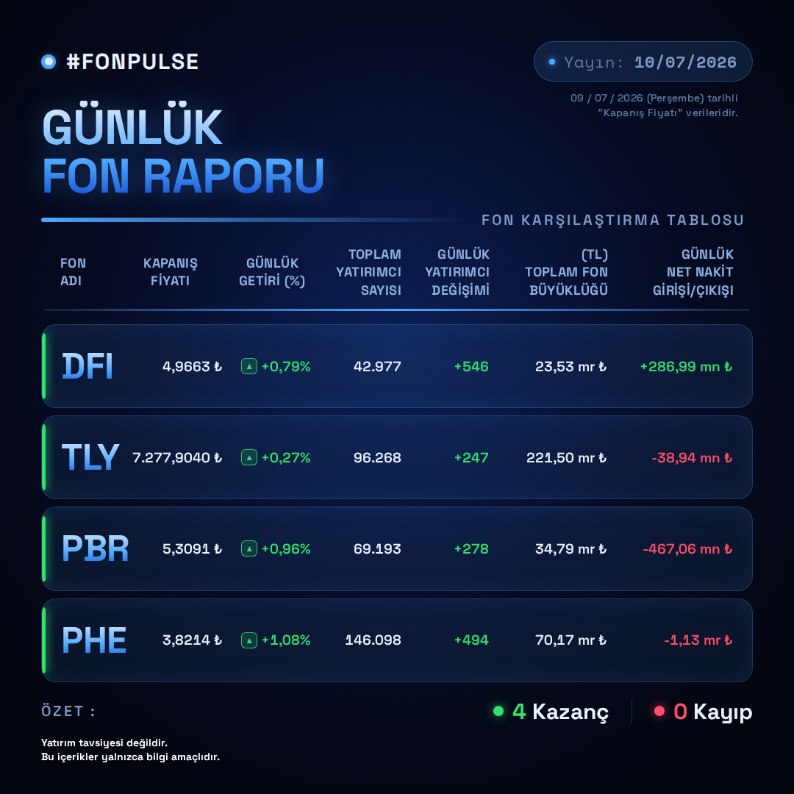

# PiyasaNabzi — Media (Assets Deposu)



**Ne içerir:** PiyasaNabzi otomasyon zincirlerinin (FonPulse, HissePulse vb.)
her gün ürettiği paylaşıma hazır **PNG görselleri** barındıran statik
assets deposu. Bu depo kod içermez; Telegram/Facebook/Instagram'a
gönderilmeden önce Instagram'ın gerektirdiği **herkese açık görsel URL'sini**
sağlamak için kullanılır (raw.githubusercontent.com üzerinden).

**Güncelleme:** Hafta içi, ilgili otomasyon repo'sunun günlük workflow'u
tarafından otomatik commit edilir — elle dosya eklenmez/silinmez.

---

## Mimari — Bu Depoya Veri Nasıl Gelir

```
PiyasaNabzi-Automation (veya ilgili -Automation repo'su)
    → shot.mjs ile 1080×1080 PNG üretir
          ↓
automation/publish_image_to_assets_repo.py
    → PNG'yi bu depoya (PiyasaNabzi-Media) GitHub API ile commit'ler
    → raw.githubusercontent.com URL'si üretir → image_url.txt
          ↓
    (üretilen URL, Instagram Business gönderiminde kullanılır;
     Telegram ve Facebook gönderimleri dosyayı doğrudan yükler)
```

Bu depo yalnızca **hedef**tir — üretim mantığı, şablonlar ve gönderim
script'leri ilgili `-Automation` reposunda tutulur.

---

## Klasör Yapısı

```
<Tema>-Snapshot-<Kapsam>-<Periyot>/
    └── <tema>_<tarih>.png
```

| Klasör | Kaynak Otomasyon | Açıklama |
|---|---|---|
| `FonPulse-Snapshot-4F-Daily` | PiyasaNabzi FonPulse (4F) · Daily | DFI/TLY/PBR/PHE günlük fon karşılaştırma tablosu — kapanış fiyatı, günlük getiri, yatırımcı sayısı/değişimi, fon büyüklüğü (AUM), günlük net nakit giriş/çıkışı. 1080×1080, dosya adı `fonpulse_YYYY-MM-DD.png`. |

Yeni bir otomasyon zinciri eklendiğinde aynı desende (`<Tema>-Snapshot-...`)
yeni bir klasör açılır; bu depoda manuel müdahale gerekmez.

---

## Dosyalar

| Dosya | Rol |
|---|---|
| `FonPulse-Snapshot-4F-Daily/fonpulse_YYYY-MM-DD.png` | O güne ait #FONPULSE günlük rapor görseli |
| `README.md` | Bu dosya — depo amacı ve klasör sözleşmesi |

---

## Erişim / Kurulum

Bu depoya yazma işlemi, ilgili `-Automation` reposundaki
`ASSETS_REPO_TOKEN` secret'ı (bu depoya yazma yetkili PAT) üzerinden,
`publish_image_to_assets_repo.py` script'i tarafından otomatik yapılır.
Elle dosya yüklenmesi gerekmez; gerekiyorsa aynı dosya adı deseni
(`<tema>_<tarih>.png`) ve klasör adı korunmalıdır, aksi halde
Instagram URL üretimi ve geçmiş arşiv taraması bozulur.

---

## Teknik Notlar

**Dosya adı = tarih sözleşmesi:** Her PNG, o günün rapor tarihini adında
taşır (`fonpulse_2026-07-10.png`). Bu, hem `image_url.txt` üretimini hem
de geçmişe dönük arşiv taramasını (belirli bir tarihin görselini bulma)
dosya adına bakarak yapılabilir kılar — ayrı bir index/veritabanı gerekmez.

**Neden ayrı bir "Media" deposu:** Instagram Graph API, görsel
gönderiminde `image_url` parametresi ister ve bu URL herkese açık
olmalıdır; otomasyon repo'sunun kendisini public yapmak yerine yalnızca
görselleri barındıran bu ayrı depo public tutulur.

**Depoyu bozabilecek şeyler:** Klasör adının değiştirilmesi veya dosya
adı deseninin bozulması, ilgili `-Automation` reposundaki
`publish_image_to_assets_repo.py` ve Instagram gönderim adımını kırar.

---

*Yatırım tavsiyesi değildir. Bu içerikler yalnızca bilgi amaçlıdır.*
